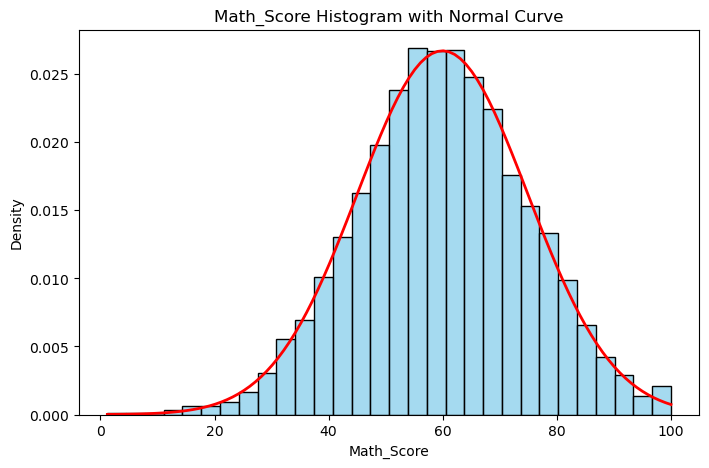
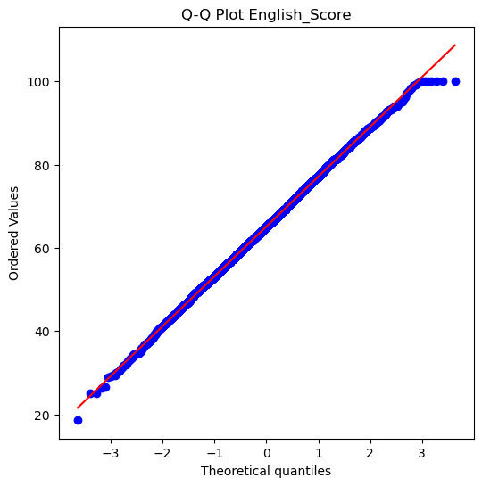

# Mathematics & Advanced Statistics — Practical Exam
## Mini Research Report — Students Scores Dataset

**Dataset:** `students_scores.csv` (~5000 records) — Student_ID, Age, Math_Score, Science_Score, English_Score, Hours_Studied, Pass_Fail (0/1)

---

## Video link ==> https://drive.google.com/drive/folders/1HoEm4HC2YyC6ETSvGnS_0kUAFKzhAi8l

## Part A — Theory (Short Questions)

### Q1. Explain Mean, Median, and Mode with a real-life example.

Mean, median, and mode are the three primary measures of central tendency, each describing the "typical" value of a dataset in a different way. The mean is the arithmetic average, calculated by summing all values and dividing by the number of observations; it is sensitive to extreme values (outliers). The median is the middle value when data is arranged in ascending or descending order — it splits the dataset into two equal halves and is far less affected by outliers than the mean. The mode is the value that occurs most frequently in the dataset, and a dataset can have one mode, multiple modes, or no mode at all.

> **Example:** If the Math_Score of five students is 40, 55, 60, 60, and 95, the mean is 62, the median is 60, and the mode is also 60 (since it repeats). Here the mean is pulled upward slightly by the outlier score of 95, while the median and mode better represent the typical student performance.

### Q2. What is the difference between Variance and Standard Deviation?

Variance and standard deviation both measure the spread or dispersion of data around the mean, but they differ in how that spread is expressed. Variance is the average of the squared differences between each data point and the mean; because the differences are squared, variance is always non-negative but is expressed in squared units (for example, marks²), which makes it harder to interpret directly. Standard deviation is simply the square root of the variance, which brings the measure back into the original units of the data (for example, marks), making it much easier to interpret and compare directly against the mean.

> **Example:** If Science_Score has a variance of 225, the standard deviation is √225 = 15 marks — meaning most students' scores lie within about 15 marks of the average score, which is a far more intuitive statement than "225 marks-squared."

### Q3. Define Normal Distribution and give one practical use case.

A Normal Distribution (also called a Gaussian distribution) is a continuous probability distribution that is symmetric about its mean, forming the well-known "bell-shaped" curve. In a normal distribution, the mean, median, and mode are all equal and located at the center of the curve, and data spreads out symmetrically on both sides according to the empirical rule — approximately 68% of values fall within one standard deviation of the mean, 95% within two, and 99.7% within three.

> **Example:** Student exam scores such as Math_Score or English_Score across a large population often approximate a normal distribution, which allows teachers to identify what percentage of students scored within a certain range, or to standardize scores using Z-scores for fair comparison across subjects.

### Q4. Explain Skewness and Kurtosis in simple words.

Skewness measures the asymmetry of a data distribution around its mean. A distribution with zero skewness is perfectly symmetric like the normal curve. Positive skewness (right-skewed) means the tail on the right side is longer, with a few unusually high values pulling the mean above the median. Negative skewness (left-skewed) means the tail on the left is longer, with a few unusually low values pulling the mean below the median.

Kurtosis measures how heavy or light the tails of a distribution are compared to a normal distribution, indicating how prone the data is to producing outliers. High kurtosis (leptokurtic) means the distribution has heavier tails and a sharper peak, so extreme values are more common than in a normal distribution. Low kurtosis (platykurtic) means the distribution has lighter tails and a flatter peak, so extreme values are rarer.

> **Example:** If Science_Score is negatively skewed, it suggests most students scored well while a small number scored very poorly, dragging the mean down below the median.

### Q5. What is Probability? Differentiate between Empirical vs Theoretical Probability with examples.

Probability is a numerical measure, ranging from 0 to 1, of how likely an event is to occur. A probability of 0 means the event is impossible, while a probability of 1 means the event is certain. Theoretical probability is calculated logically based on the known structure of a situation, before any experiment is actually performed, using the formula: number of favorable outcomes divided by total possible outcomes. Empirical (or experimental) probability, on the other hand, is calculated from actual observed data or experiments — it is the ratio of the number of times an event actually occurred to the total number of trials conducted.

> **Example:** The theoretical probability of a fair coin landing on heads is 1/2 = 0.5. However, if we flip a coin 100 times and observe 47 heads, the empirical probability of heads from that experiment is 47/100 = 0.47. Similarly, calculating P(Pass_Fail = 1) directly from the `students_scores.csv` dataset — by dividing the number of students who passed by the total number of students — is an example of empirical probability.

### Q6. Explain Independent vs Dependent Events with one example each.

Two events are independent if the occurrence of one event has no effect whatsoever on the probability of the other event occurring; mathematically, P(A ∩ B) = P(A) × P(B). Two events are dependent if the occurrence of one event changes the probability of the other event occurring; in this case, the conditional probability P(B|A) is not equal to P(B).

> **Example (Independent):** A student's Age and the outcome of a coin toss are independent — knowing the student's age tells us nothing about how the coin will land.
> **Example (Dependent):** Hours_Studied and Pass_Fail are dependent — students who study more than 5 hours have a noticeably different (typically higher) probability of passing than those who study less, which is exactly what the conditional probability P(Pass | Hours_Studied > 5) is designed to measure.

### Q7. What is the intuition of Bayes Theorem in daily life?

Bayes Theorem describes how to update the probability of a hypothesis (belief) as new evidence becomes available. It is expressed as P(A|B) = [P(B|A) × P(A)] / P(B), where P(A) is the prior belief before seeing the evidence, P(B|A) is the likelihood of observing the evidence given the hypothesis is true, and P(A|B) is the updated (posterior) belief after accounting for the evidence. In simple words, Bayes Theorem is the mathematical version of "revising your opinion once you learn something new."

> **Example:** If a student is generally assumed to have a 50% chance of passing, but we then learn they studied more than 5 hours (the evidence), Bayes Theorem lets us revise that 50% prior probability upward into a more accurate posterior probability of passing, based on how much studying more than 5 hours is historically associated with passing in the dataset — very similar to how a doctor revises the probability of a disease after seeing a positive test result.

### Q8. Explain Eigenvalue and Eigenvector in simple terms.

For a given square matrix A, an eigenvector is a special non-zero vector that does not change its direction when the matrix transformation is applied to it — it only gets stretched or compressed. The eigenvalue is the scalar (number) by which that eigenvector is stretched or compressed during the transformation. This relationship is expressed by the equation A·v = λ·v, where v is the eigenvector and λ (lambda) is its corresponding eigenvalue.

> **Example:** If a dataset containing Math_Score and Science_Score is represented as a covariance matrix, its eigenvectors point in the directions along which the data varies the most, and the corresponding eigenvalues tell us how much variance exists along each of those directions. This is the core intuition behind Principal Component Analysis (PCA), which is used to reduce the number of dimensions in a dataset while retaining most of its important information.

---

## Part B — Python Programming (Code + Output)

### Setup

```python
import pandas as pd
import numpy as np
import matplotlib.pyplot as plt
from scipy import stats
import seaborn as sns
```

---

### Step 1: Measures of Central Tendency & Dispersion

**Calculate mean, median, mode of Math_Score.**

```python
df = pd.read_csv("students_scores.csv")

math_mean = df["Math_Score"].mean()
math_median = df["Math_Score"].median()
math_mode = df["Math_Score"].mode()[0]
print("Mean:", math_mean)
print("Median:", math_median)
print("Mode:", math_mode)
```

**Output:**
```
Mean: 59.95652
Median: 59.9
Mode: 65.0
```

**Find range, variance, standard deviation of Science_Score.**

```python
sci_range = df["Science_Score"].max() - df["Science_Score"].min()
sci_var = df["Science_Score"].var()
sci_std = df["Science_Score"].std()
print("Range:", sci_range)
print("Variance:", sci_var)
print("Standard Deviation:", sci_std)
```

**Output:**
```
Range: 92.9
Variance: 197.69392542148475
Standard Deviation: 14.060367186581038
```

---

### Step 2: Probability Basics

**Find the probability of students passing (Pass_Fail = 1).**

```python
p_pass = df["Pass_Fail"].mean()
print("P(Pass):", p_pass)
```

**Output:**
```
P(Pass): 0.7294
```

**Create a contingency table between Pass_Fail and Hours_Studied > 5.**

```python
df["Studied_gt_5"] = df["Hours_Studied"] > 5
contingency = pd.crosstab(df["Pass_Fail"], df["Studied_gt_5"])
print(contingency)
```

**Output:**
```
Studied_gt_5  False  True
Pass_Fail
0               642    711
1              1962   1685
```

**Calculate conditional probability: P(Pass | Hours_Studied > 5).**

```python
subset = df[df["Studied_gt_5"] == True]
p_pass_given_studied = subset["Pass_Fail"].mean()
print("P(Pass | Hours>5):", p_pass_given_studied)
```

**Output:**
```
P(Pass | Hours>5): 0.7032554257095158
```

---

### Step 3: Distribution & Visualization

**Plot a Histogram & Normal curve for Math_Score.**

```python
plt.figure(figsize=(8,5))
sns.histplot(df["Math_Score"], kde=False, stat="density", bins=30, color="skyblue")
mu, sigma = df["Math_Score"].mean(), df["Math_Score"].std()
x = np.linspace(df["Math_Score"].min(), df["Math_Score"].max(), 100)
plt.plot(x, stats.norm.pdf(x, mu, sigma), 'r-', lw=2)
plt.title("Math_Score Histogram with Normal Curve")
plt.savefig("math_hist.png")
plt.show()
```

**Output:**



**Calculate Skewness & Kurtosis for Science_Score.**

```python
skewness = df["Science_Score"].skew()
kurtosis = df["Science_Score"].kurt()
print("Skewness:", skewness)
print("Kurtosis:", kurtosis)
```

**Output:**
```
Skewness: -0.016202640190253637
Kurtosis: -0.01962364243457282
```

**Perform a Q-Q Plot for English_Score.**

```python
plt.figure(figsize=(6,6))
stats.probplot(df["English_Score"], dist="norm", plot=plt)
plt.title("Q-Q Plot English_Score")
plt.savefig("qq_english.png")
plt.show()
```

**Output:**



---

### Step 4: Linear Algebra Mini Task

**Represent Math_Score and Science_Score of first 5 students as vectors.**

```python
v_math = df["Math_Score"].values[:5]
v_sci = df["Science_Score"].values[:5]
print("Math_Score values:", v_math)
print("Science_Score values:", v_sci)
```

**Output:**
```
Math_Score values: [67.5 54.9 62.9 68.1 51.3]
Science_Score values: [41.2 44.1 46.4 58.7 59.1]
```

**Dot product of the two vectors.**

```python
dot_product = np.dot(v_math, v_sci)
print("Dot Product:", dot_product)
```

**Output:**
```
Dot Product: 15149.95
```

**Norm 1 and Norm 2 of Math_Score vector.**

```python
norm1 = np.linalg.norm(v_math, ord=1)
norm2 = np.linalg.norm(v_math, ord=2)
print("Norm1:", norm1, "Norm2:", norm2)
```

**Output:**
```
Norm1: 304.7 Norm2: 137.09839532248364
```

**Find angle between the two vectors.**

```python
cos_theta = dot_product / (np.linalg.norm(v_math) * np.linalg.norm(v_sci))
angle = np.degrees(np.arccos(np.clip(cos_theta, -1, 1)))
print("Angle:", angle, "degrees")
```

**Output:**
```
Angle: 11.687360867230236 degrees
```

---

## Key Insights

- On average, students score **~60 marks** in Math (mean 59.96, median 59.9), and the distribution is close to symmetric, following a Math_Score histogram that closely tracks the overlaid normal curve.
- **72.9%** of all students in the dataset passed (Pass_Fail = 1), showing an overall healthy pass rate.
- Contrary to intuition, students who studied **more than 5 hours** passed at almost the same rate (**70.3%**) as the overall average — hours studied alone is a weak predictor of passing in this dataset, and other factors (or the synthetic data's noise) play a bigger role.
- Science_Score is very close to a **normal distribution**: skewness (-0.016) and kurtosis (-0.020) are both near zero, indicating minimal asymmetry and tail-heaviness.
- The **English_Score Q-Q plot** follows the reference line closely across the middle range, confirming near-normality, with only mild deviation at the extreme tails (very low and very high scorers).
- The **angle of ~11.7°** between the Math_Score and Science_Score vectors (first 5 students) indicates the two subjects' scores are strongly aligned/correlated for this sample — students who score well in Math also tend to score well in Science.

---

## Deliverables

1. `Students_scores.ipynb` — Python/Jupyter notebook with all calculations (Steps 1–4).
2. `README.md` (this file) — Theory answers (Part A) + code, outputs, and insights (Part B).
