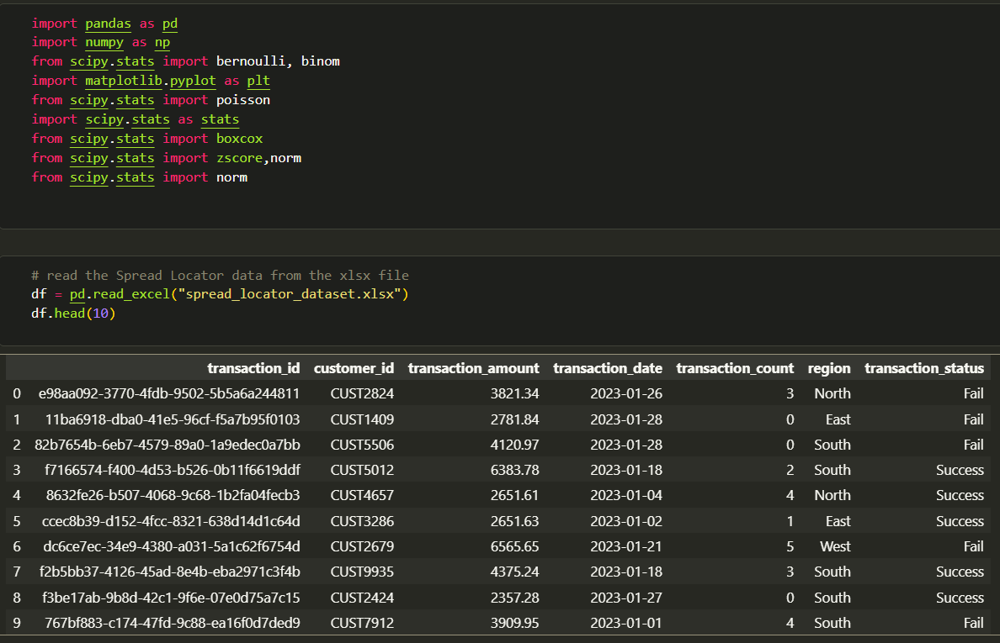
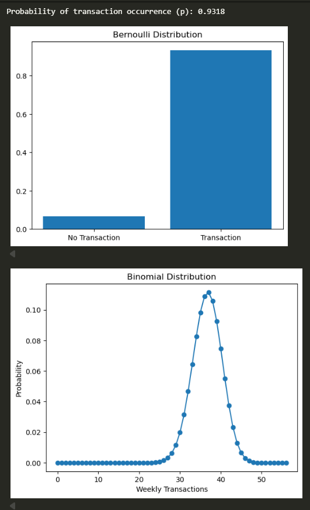
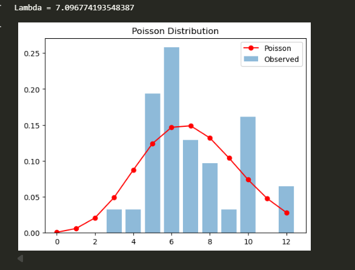
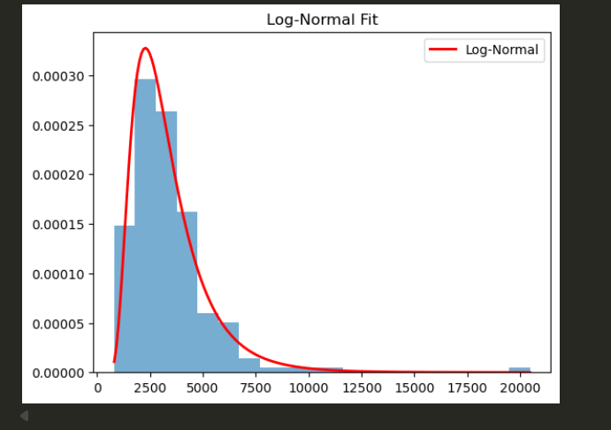
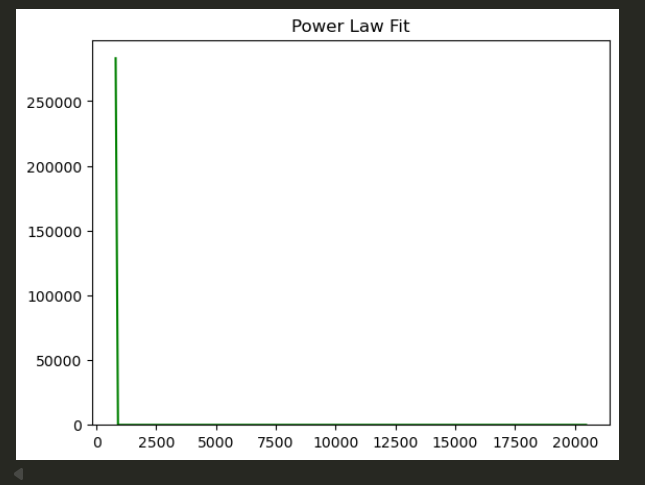
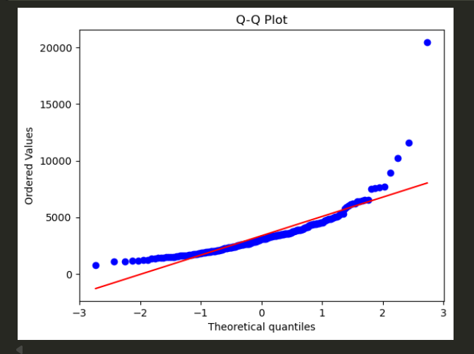
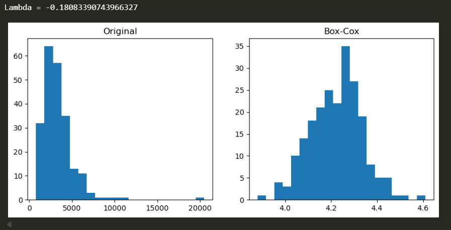
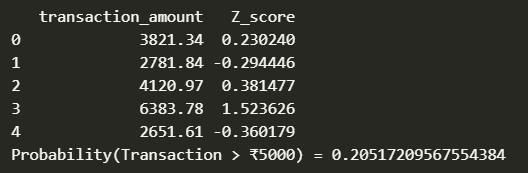
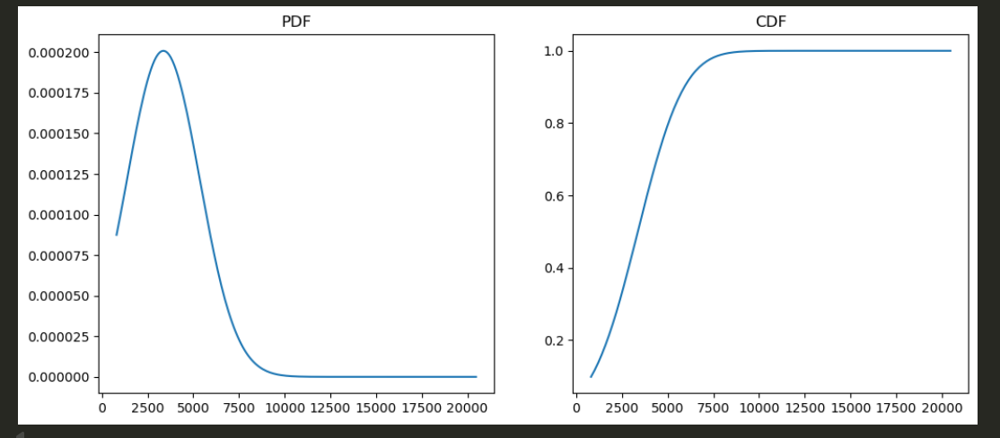

# Spread Locator — Probability Distributions & Spread Analysis

This project applies probability distribution modeling and transformation techniques to a transactional dataset. It is designed to show how Bernoulli, Binomial, Poisson and Log-Normal statistical tools can explain customer transaction behavior.

## 📺 video link 
https://drive.google.com/drive/folders/1CDAvA1-B1MKlptTYmFy697g2CctqlBBK

## 📘 Part A — Theoretical Foundation

Part A is represented by the theory notes in the workbook and supports the analysis in `Part_B.ipynb`.

1. **Bernoulli distribution** — models whether a transaction occurs or not on a given day.
2. **Binomial distribution** — models counts of transactions in a fixed number of trials, such as weekly transaction events.
3. **Poisson distribution** — models the number of events occurring in a fixed interval of time, such as daily transaction counts.
4. **Log-Normal distribution** — appropriate for positively skewed financial amounts.
5. **Power-Law distribution** — used to test for heavy-tail behavior in transaction amounts.
6. **Q-Q plot** — assesses whether transaction amounts match a normal distribution.
7. **Box-Cox transformation** — stabilizes variance and reduces skewness to improve normality.
8. **Z-score and normal approximation** — estimates probability for large transaction values.

These concepts justify the choice of each distribution and transformation used in the analysis.

## 📗 Part B Data Analysis & Testing
- Data is loaded and inspected for structure and summary statistics.

- Transaction occurrence is converted into a Bernoulli experiment. and Weekly transaction counts are modeled with a Binomial distribution.

- Daily counts are compared against a Poisson model.

- Transaction amounts are fit to Log-Normal and Power-Law distributions.

- Normality is assessed using Q-Q plots.

- Box-Cox transform is applied to improve distribution shape.

- Z-score probability is used to estimate likelihood of high-value transactions.

- PDF and CDF curves are plotted to visualize amount behavior.

## 📈 Key Findings

| Analysis | Result |
|---|---|
| Bernoulli distribution | Transaction occurrence is well modeled by Bernoulli. |
| Binomial distribution | Weekly transaction counts are suitable for Binomial approximation. |
| Poisson distribution | Daily transaction counts fit Poisson behavior. |
| Log-Normal fit | Transaction amounts are better modeled by Log-Normal than Power-Law. |
| Q-Q plot | Amounts are not normally distributed. |
| Box-Cox transformation | Improves normality and reduces skewness. |
| Z-score probability | Normal approximation may underestimate tail probability for large values. |