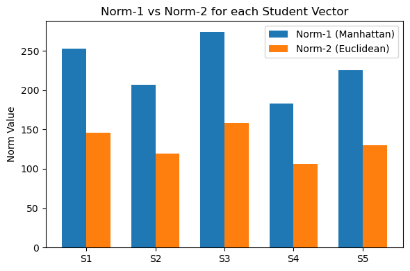
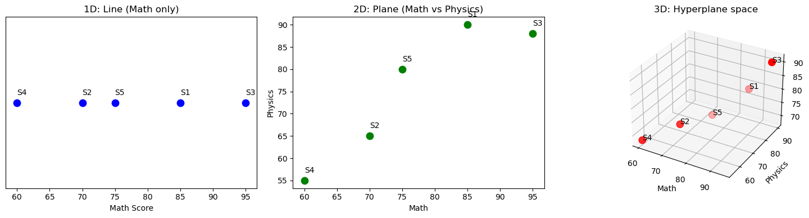
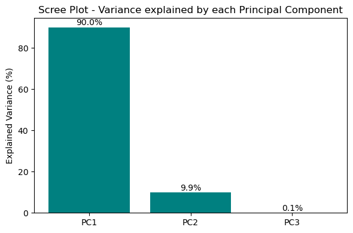

# Calculative Foundation

## Video link ==> https://drive.google.com/drive/folders/1YDPa1ORvYBLnfVJxUEQ4BGlaWha7VhVX

A hands-on Linear Algebra project that i applies core vector, matrix, geometric, and eigendecomposition concepts to a small dataset (Math, Physics, Chemistry across 5 students).

## Dataset

| Student | Math | Physics | Chemistry |
|---|---|---|---|
| S1 | 85 | 90 | 78 |
| S2 | 70 | 65 | 72 |
| S3 | 95 | 88 | 91 |
| S4 | 60 | 55 | 68 |
| S5 | 75 | 80 | 70 |

---

## Part A — Vector & Matrix Fundamentals

### A1. Vector Representation
Each student's scores are represented as a vector:
```
S1 = [85. 90. 78.]
S2 = [70. 65. 72.]
S3 = [95. 88. 91.]
S4 = [60. 55. 68.]
S5 = [75. 80. 70.]
```

### A2. Vector Norms
- **Norm-1 (Manhattan norm):** `|x1| + |x2| + |x3|` — sum of absolute values
- **Norm-2 (Euclidean norm):** `sqrt(x1² + x2² + x3²)` — straight-line magnitude

**Norm-1 vs Norm-2 comparison**



### A3. Dot Product & Angle Between Vectors
Formula: `a·b = a1*b1 + a2*b2 + a3*b3`, `cos θ = (a·b) / (|a| * |b|)`

All pairwise dot products and angles between students:

| Pair | Dot Product | Angle |
|---|---|---|
| S1 & S2 | 17416.0 | 5.70° |
| S1 & S3 | 23093.0 | 4.30° |
| S1 & S4 | 15354.0 | 8.35° |
| S1 & S5 | 19035.0 | 0.38° |
| S2 & S3 | 18922.0 | 1.91° |
| S2 & S4 | 12671.0 | 2.88° |
| S2 & S5 | 15490.0 | 5.52° |
| S3 & S4 | 16728.0 | 4.79° |
| S3 & S5 | 20535.0 | 4.21° |
| S4 & S5 | 13660.0 | 8.11° |

### A4. Cross Product
The cross product of two vectors yields a vector perpendicular to both:

```
S1 x S2 (cross product) = [1410. -660. -775.]
S3 x S4 (cross product) = [979. -1000. -55.]
```

### A5. Vector Projection
Formula: `proj_b(a) = ( (a·b) / |b|² ) * b`

```
Projection of S1 onto S2 = [85.2   79.114 87.634]
Projection of S3 onto S4 = [89.224 81.789 101.12]
```

## Part B — Matrix Operations

### B1. Matrix Addition and Multiplication

**Addition** — adding a uniform bonus-marks matrix (+2 to every score):

```
M + bonus =
[[87. 92. 80.]
 [72. 67. 74.]
 [97. 90. 93.]
 [62. 57. 70.]
 [77. 82. 72.]]
```

**Multiplication** — weighted total score per student using subject weights `[0.4, 0.3, 0.3]` (`M x weights`):

| Student | Weighted Total |
|---|---|
| S1 | 84.40 |
| S2 | 69.10 |
| S3 | 91.70 |
| S4 | 60.90 |
| S5 | 75.00 |

### B2. Transpose
Converts the 5x3 Students x Subjects matrix into a 3x5 Subjects x Students matrix:

```
M^T =
[[85. 70. 95. 60. 75.]
 [90. 65. 88. 55. 80.]
 [78. 72. 91. 68. 70.]]
Shape: (3, 5)
```

### B3. Determinant and Inverse
Using the 3x3 sub-matrix from students S1, S2, S3:

```
M_square =
[[85. 90. 78.]
 [70. 65. 72.]
 [95. 88. 91.]]

Determinant = 5345.00

Inverse Matrix =
[[-0.079 -0.248  0.264]
 [ 0.088  0.061 -0.123]
 [-0.003  0.2   -0.145]]
```

Verification that `M x M_inverse` returns the identity matrix:

```
[[ 1.  0. -0.]
 [-0.  1.  0.]
 [-0.  0.  1.]]
```

---

## Part C — Linear Transformations & Geometry

### C1. Line, Plane, and Hyperplane
Explains how the dataset's geometry changes with dimension count:
- **Line (1D):** with only 1 subject (e.g. Math), each student is a point on a number line.
- **Plane (2D):** with 2 subjects (Math, Physics), each student becomes an (x, y) point on a flat plane.
- **Hyperplane (nD):** with 3+ subjects, data forms points in higher-dimensional space, and a hyperplane is a flat (n-1)-dimensional subspace dividing that space in two — e.g. a plane is a hyperplane in 3D, a line is a hyperplane in 2D.

### C2. Dimensionality Increase
As new subjects (features) are added, dimensionality increases:
- 1 subject → 1D (line)
- 2 subjects → 2D (plane)
- 3 subjects → 3D (space, hyperplane = 2D cutting plane)
- 4+ subjects → higher-dimensional space (cannot be visualized directly, but the same vector/matrix operations still apply mathematically)

**1D → 2D → 3D dimensionality increase (from the notebook output):**



---

## Part D — Eigenvalues & Decomposition

### D1. Standardization and Covariance Matrix
Data is standardized (mean 0, standard deviation 1) using `StandardScaler`:

```
Standardized Data =
[[ 0.662  1.063  0.265]
 [-0.579 -0.783 -0.458]
 [ 1.49   0.916  1.83 ]
 [-1.407 -1.521 -0.939]
 [-0.166  0.325 -0.698]]
```

Covariance matrix (3x3, subject-wise) computed from the standardized data:

```
Cov =
[[1.25  1.152 1.151]
 [1.152 1.25  0.879]
 [1.151 0.879 1.25 ]]
```

### D2. Eigenvalues and Eigenvectors
Computed from the covariance matrix:

```
Eigenvalues = [3.376 0.003 0.371]

Eigenvectors (each column is an eigenvector) =
[[ 0.608  0.794 -0.001]
 [ 0.561 -0.431 -0.707]
 [ 0.561 -0.429  0.708]]

Sorted Eigenvalues (descending) = [3.376 0.371 0.003]
```

**Scree plot — explained variance per principal component (from the notebook output):**



### D3. Principal Component Analysis (PCA) — Explained Variance
| Component | Explained Variance |
|---|---|
| PC1 | 90.04% |
| PC2 | 9.88% |
| PC3 | 0.08% |

